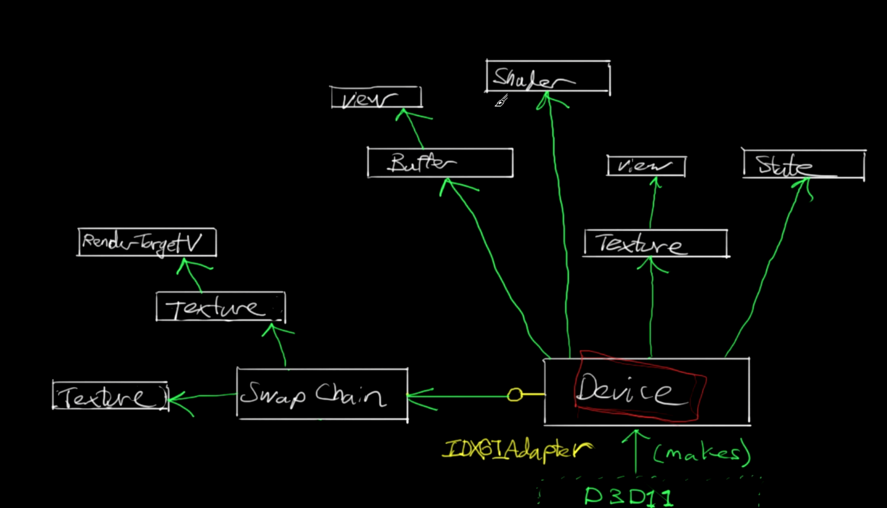
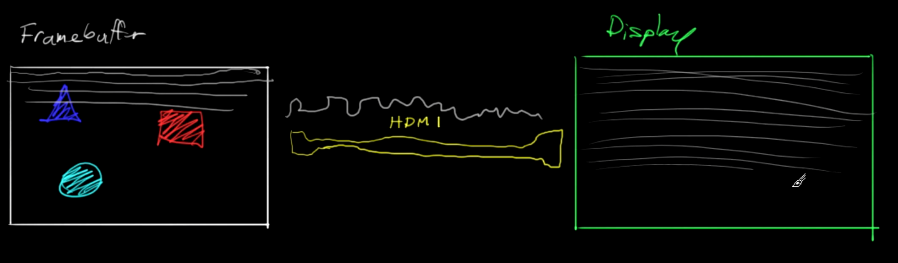

# Directx Architecture



## Device
The representation of graphics device, in this case graphics card, used to create swap chains, shaders, resources ect  
Created using factory function CreateDevice

## Swap chain
How the pixel data actually gets to the monitor
 
 Contains framebuffers that are used to draw on, and then send them to monitor.  
 Usually use 2 Framebuffers(Double buffering), swapchain is used to flip those framebuffers, when frame is ready to be drawn.
 

## DXGI
Contains functions that changes rarer than Directx3d changes. Used to create swap chain.

```cpp 
HRESULT D3D11CreateDeviceAndSwapChain(
    IDXGIAdapter                *pAdapter,
    D3D_DRIVER_TYPE             DriverType,
    HMODULE                     Software,
    UINT                        Flags,
    const D3D_FEATURE_LEVEL     *pFeaterLevels,
    UINT                        FeatureLevels,
    UINT                        SDKVersion,
    const DXGI_SWAP_CHAIN_DESC  *pSwapChainDesc,
    IDXGISwapChain              **ppSwapChain,
    ID3D11Device                **ppDevice,
    D3D_FEATURE_LEVEL           *pFeatureLevel,
    ID3D11DeviceContext         **ppImmediateContext
);
```
## DeviceContext
Points to Graphics adaptor. Is basically the same as Device. Device is used to allocate resources **(setup boolshit)**, but DeviceContext is used for issuing rendering commands and configuring rendering pipeline **(Actual drawing)**

Two types of contexts:  
- immediate (Immediately executes the commands, can querry graphics driver)
- deferred (Used for multithreaded workflows)


