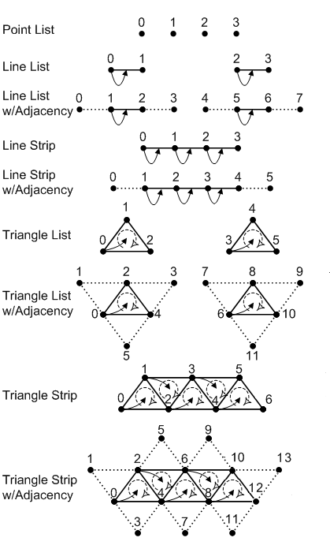

# Directx Architecture


## Device
The representation of graphics device, in this case graphics card, used to create swap chains, shaders, resources ect  
Created using factory function CreateDevice

## Swap chain
How the pixel data actually gets to the monitor
 
 Contains framebuffers that are used to draw on, and then send them to monitor.  
 Usually use 2 Framebuffers(Double buffering), swapchain is used to flip those framebuffers, when frame is ready to be drawn.
 

## DXGI
Contains functions that changes rarer than Directx3d changes. Used to create swap chain.

```cpp 
HRESULT D3D11CreateDeviceAndSwapChain(
    IDXGIAdapter                *pAdapter,
    D3D_DRIVER_TYPE             DriverType,
    HMODULE                     Software,
    UINT                        Flags,
    const D3D_FEATURE_LEVEL     *pFeaterLevels,
    UINT                        FeatureLevels,
    UINT                        SDKVersion,
    const DXGI_SWAP_CHAIN_DESC  *pSwapChainDesc,
    IDXGISwapChain              **ppSwapChain,
    ID3D11Device                **ppDevice,
    D3D_FEATURE_LEVEL           *pFeatureLevel,
    ID3D11DeviceContext         **ppImmediateContext
);
```
## DeviceContext
Points to Graphics adaptor. Is basically the same as Device. Device is used to allocate resources **(setup boolshit)**, but DeviceContext is used for issuing rendering commands and configuring rendering pipeline **(Actual drawing)**

Two types of contexts:  
- immediate (Immediately executes the commands, can querry graphics driver)
- deferred (Used for multithreaded workflows)


## Pipeline

Direct3d 12 pipeline


Direct3d 11 pipeline  


### General c++ notes
Alot of functions take pointer to an array of pointers

if you need **pp for filling -> use &pThing
if you need **pp -> use GetAdressof() // Gets adress of pointer  
if you need *p -> use Get() // Gets dumb pointer
### Input Assembler
```cpp 
struct Vertex
	{
		float x;
		float y;
	};

	// create vertex buffer (1 2d triangle at center of screen)
	const Vertex vertices[] =
	{
		{ 0.0f,0.5f },
		{ 0.5f,-0.5f },
		{ -0.5f,-0.5f },
	};

    // Buffer that holds our vertices
	wrl::ComPtr<ID3D11Buffer> pVertexBuffer;
    // Descriptor that describes our vertex buffer
	D3D11_BUFFER_DESC bd = {};
    // How it will be bound to pipeline
	bd.BindFlags = D3D11_BIND_VERTEX_BUFFER;
    // Using default one(read and write by GPU)
	bd.Usage = D3D11_USAGE_DEFAULT;
    // Cpu wont be able to access
	bd.CPUAccessFlags = 0u;
	bd.MiscFlags = 0u;
	bd.ByteWidth = sizeof(vertices);
	bd.StructureByteStride = sizeof(Vertex);

    // Actual data that will be transfered to GPU 
	D3D11_SUBRESOURCE_DATA sd = {};
    // Data on CPU 
	sd.pSysMem = vertices;

    // Creates buffer
	GFX_THROW_INFO(pDevice->CreateBuffer(&bd, // Adress of descriptor
     &sd, // Adress if subresource
     &pVertexBuffer // Pointer to pointer to fill up
     ));

	// Bind vertex buffer to pipeline
	const UINT stride = sizeof(Vertex);
	const UINT offset = 0u;

	pContext->IASetVertexBuffers(
        0u, 1u, 
        pVertexBuffer.GetAddressOf(), // We dont wanna release the data
        &stride, &offset
        );
```

```cpp
// Set primitive topology to triagle list (groups of 3 vertices)
pContext->IASetPrimitiveTopology(D3D11_PRIMITIVE_TOPOLOGY_TRIANGLELIST);

```

### Vertex Shader

Return value : SV_Position special system variable(starts with SV_)  
In Visual studio properties necessary to define what kinda shader is beeing created
```cpp 
float4 main( float2 pos : Position ) : SV_Position 
{
	return float4(pos.x,pos.y,0.0f,1.0f);
}
```

#### Loading shaders :

```cpp
#include <d3dcompiler.h>
// Create vertex shader
wrl::ComPtr<ID3D11VertexShader> pVertexShader;
//Reading to blob
D3DReadFileToBlob(L"VertexShader.cso", &pBlob);
pDevice->CreateVertexShader(pBlob->GetBufferPointer(), pBlob->GetBufferSize(), nullptr, &pVertexShader);

// Bind vertex shader
pContext->VSSetShader(
    pVertexShader.Get() // Gets underlying dumb pointer
    , nullptr, 0u
    );

// Bind vertex Layout
pContext->IASetInputLayout(pInputLayout.Get());
```

#### Have to describe stuff we are sending to shader

```cpp
// Input (vertex) layout (2d position only)
wrl::ComPtr<ID3D11InputLayout> pInputLayout;
const D3D11_INPUT_ELEMENT_DESC ied[] =
{
	{"Position",// Position have to match vertex shader
    0,// index of semantic forexample for multiple possitions
    DXGI_FORMAT_R32G32_FLOAT, //what data is in pur layout 2 x 32 bites(floats)
    0,0, // offset
    D3D11_INPUT_PER_VERTEX_DATA,0},
};
GFX_THROW_INFO(pDevice->CreateInputLayout(
	ied,(UINT)std::size(ied),
	pBlob->GetBufferPointer(), // Vertex shader bytecde to check if semantics line up
	pBlob->GetBufferSize(),
	&pInputLayout // **pp for filling
));
```


### Geometry shader
### Pixel Shader
```cpp
float4 main() : SV_Target
{
	return float4(1.0f,1.0f,1.0f,1.0f);
}
```

```cpp
// create pixel shader
wrl::ComPtr<ID3D11PixelShader> pPixelShader;
wrl::ComPtr<ID3DBlob> pBlob;
D3DReadFileToBlob(L"PixelShader.cso", &pBlob);
pDevice->CreatePixelShader(pBlob->GetBufferPointer(), pBlob->GetBufferSize(), nullptr, pPixelShader);
// bind pixel shader
pContext->PSSetShader(pPixelShader.Get(), nullptr, 0u);
```
### Output merger
```cpp
// bind render target (target is framebuffer in this case)
pContext->OMSetRenderTargets(1u, pTarget.GetAddressOf(), nullptr);
```
### Render targets

Usually frame buffer, but can be anything.  
The thing you wanna render to.

#### Viewport
Can be used for split screen stuff
```cpp
// configure viewport
	D3D11_VIEWPORT vp;
	vp.Width = 800;
	vp.Height = 600;
	vp.MinDepth = 0;
	vp.MaxDepth = 1;
	vp.TopLeftX = 0;
	vp.TopLeftY = 0;
	pContext->RSSetViewports(1u, &vp);
```

