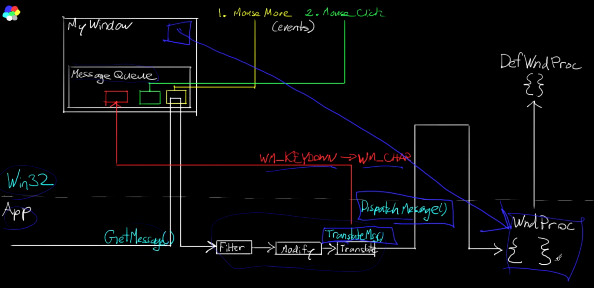

# Windows API
## Solution setup

- C/C++\General\Multi Processor Compilation -> Yes
- C/C++\Optimisation\Favor size or speed -> Favor fast code  
**Change Configuration to Release**  
- C/C++\Preprocessor\Preprocessor Definitions -> Add "NDEBUG"  
  `This is important if we wanna link to standart library statically`  
- C/C++\Preprocessor\Code generation\Runtime library -> Multi-threaded (/MT)  
**Change Configuration to Debug**  
- C/C++\Preprocessor\Code generation\Runtime library -> Multi-threaded Debug (/MTd)  
  **Change Configuration to All Configurations**  
- C/C++\Code generation\Floating Point Model -> Fast  
- C/C++\Language\C++ Language standard->Latest
- C/C++\Linker\System\SubSystem -> Windows

## Windows setup

```cpp
int CALLBACK WinMain(         // Custom calling convention stdcall, similar for all winapi functions
	HINSTANCE hInstance,      // Windows instance
	HINSTANCE hPrevInstance,  // Always NULL not important
	LPSTR	  lpCmdLine,      // Commandline
	int		  nCmdShow)       // Indication how the window is shown when program is created
{

}
```
For windows everything is windows or messages

First steps:
```cpp
const auto pClassName = L"hw3dbutts";
// register window class
WNDCLASSEXW wc = { 0 };
wc.cbSize = sizeof(wc);				//Size of the structure
wc.style = CS_OWNDC;				//Class style CS_OWNDC every window will haveseparete device context
wc.lpfnWndProc = DefWindowProc;		//Function tha handles all the messages we willuse default for now
wc.cbClsExtra = 0;					//Alows allocate extra bites for the window classstructure
wc.cbWndExtra = 0;					//Alows allocate extra bites for each window
wc.hInstance = hInstance;			//Instance
wc.hIcon = nullptr;					//Custom icons
wc.hCursor = nullptr;				//Custom cursor
wc.hbrBackground = nullptr;			//Brush for background will use dx3d
wc.lpszMenuName = nullptr;			//Menu name (Wont use for now)
wc.lpszClassName = pClassName;		//Name that we will use to register class
wc.hIconSm = nullptr;				//Custom icon for app
RegisterClassEx(&wc);
//Create Window
HWND hWnd = CreateWindowExW(
	0, pClassName,
	L"Happy Hard Window",
	WS_CAPTION | WS_MINIMIZEBOX | WS_SYSMENU, // Styles, cool stuff
	200, 200, 640, 480,
	nullptr, nullptr, hInstance, nullptr
);
ShowWindow(hWnd, SW_SHOW);
```

## Windows messages

Windows enherently is event driven system



### Algrithm works like this:
- You click a button, the event is sent to message queue
- When you are ready you call GetMessage() and get the bottom event from queue
- Then you process this event(Filter, Modify, Translate)
- Then we call DispatchMessage(), this sends message back to Win32 side, win32 then process this message
- Win32 passes this message to WindowsProcidure(The one we passed in when created the windows)
- Then it calls DefaultWindowsProcidure

### GetMessage function
```cpp
GetMessage( 
		LPMSG lpMsg, // LPMSG lpMsg - Pointer to the message(Structure for Win32 to fill)
		nullptr, // HWND hWnd - Handle to window(we pass nullptr then we get messages for all windows)
		0, // UINT wMsgFilterMin - range of message numbers (0 for all messages)
		0 // UINT wMsgFilterMax - range of message numbers (0 for all messages)
	);
```

### Code Should look like this:
```cpp
//Handle messages
MSG msg;
while (GetMessage(&msg,nullptr,0,0)>0)
{
	TranslateMessage(&msg);
	DispatchMessageW(&msg);
}
```

### Our Custom Windows Procidure

We pass it when creating a window in place of default windows procidure
```cpp
LRESULT CALLBACK WndProc(HWND hWnd, UINT msg, WPARAM wParam, LPARAM lParam)
{
	switch (msg)
	{
	case WM_CLOSE:
		PostQuitMessage(69);
		break;
	}
	return DefWindowProc(hWnd, msg, wParam, lParam);
}
```

### Handling key events
List of message names:  

List of Virtual codes:  
https://learn.microsoft.com/en-us/windows/win32/inputdev/wm-keydown  
https://learn.microsoft.com/en-us/windows/win32/inputdev/virtual-key-codes

If character keys are getting pressed then Translate message adds an aditional WM_CHAR message to message queue. WM_CHAR can be used to get capital letters, and is mostly used when text processing is needed.
For reguler key commands WM_KEYDONW is mostly used.